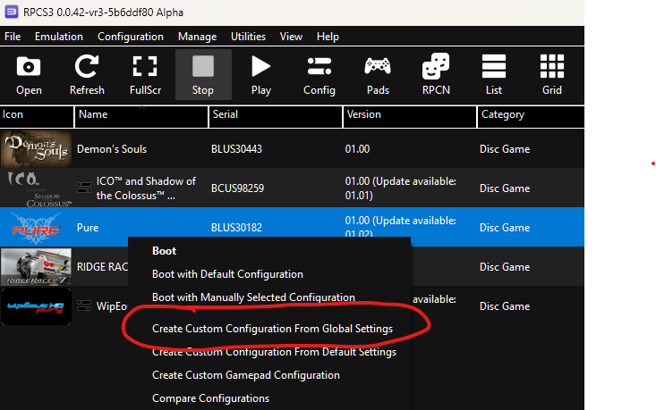
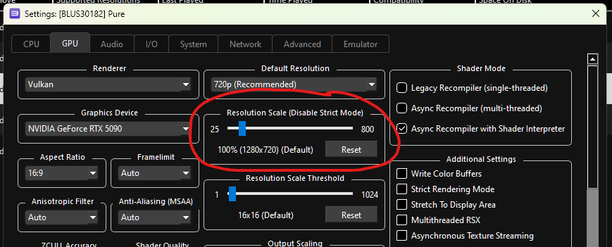
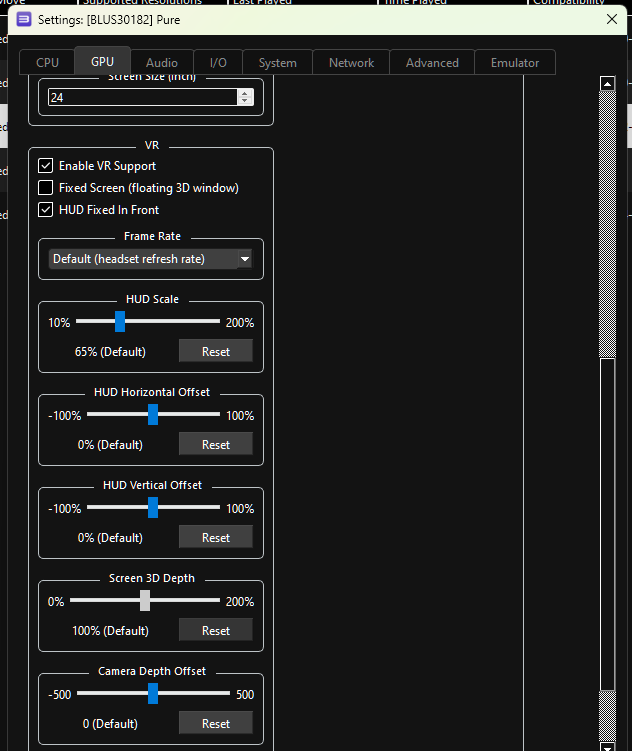
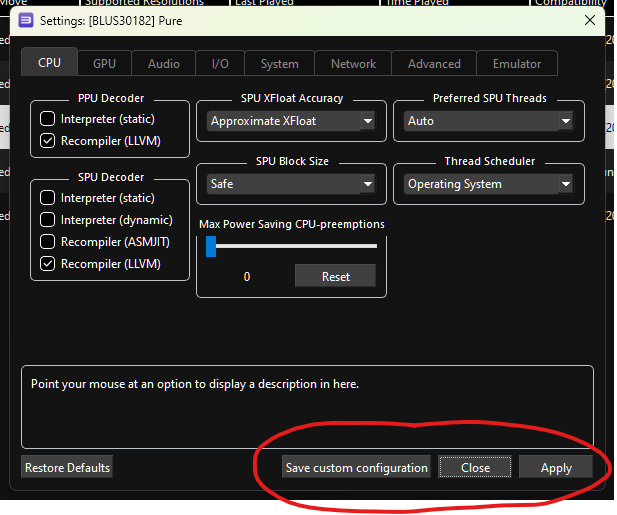
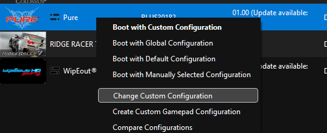

# Changing resolution and VR settings

Each VR game has its own settings, kept in a **custom configuration** for that game. This guide shows how
to create one, raise the resolution and adjust the VR options. See [vr-games.md](vr-games.md) for the
recommended settings for each game.

## 1. Create a custom configuration for the game

In the game list, right-click the game and choose **Create Custom Configuration From Global Settings**.

The settings window opens, titled with the game's serial and name (for example `[BLUS30182] Pure`).
Everything you change here applies to this game only.

## 2. Raise the resolution

On the **GPU** tab, drag **Resolution Scale** to the right. 100% is the PS3's own resolution (1280x720);
300-400% is a good starting point on a fast graphics card.

Higher is sharper but slower. Every image is drawn once per eye, so very high scales can run out of video
memory and the game slows to a crawl. If the frame rate drops, lower it again.

VR games always run at the PS3's 720p output, whatever **Default Resolution** says: the VR profiles are made
at 720p, and some games change how they draw at 1080p (God of War stays on a flat screen). Use **Resolution
Scale** for a sharper image.

## 3. Adjust the VR settings

Scroll down the **GPU** tab to the **VR** section.

| Setting | What it does |
|---|---|
| Enable VR Support | Renders the game in stereo in your headset. On by default for games with a VR profile. Takes effect when the game is restarted. |
| Fixed Screen (floating 3D window) | Shows the game as a floating 3D screen 2 m in front of you instead of surrounding you. The game keeps its own camera. |
| HUD Fixed In Front | Keeps the HUD and menus in front of you instead of following your head; turn your head to look away from them. With Fixed Screen, it keeps the screen in place in the room. |
| Frame Rate | The game's frame rate in the headset. The default is the game's own (see [vr-games.md](vr-games.md)); a slower PC can choose a lower rate. Set the headset to this rate or a multiple of it. |
| Cinematic Scenes | Only for games whose VR profile marks scenes that cost far more to draw than gameplay, such as Gran Turismo 5's pre-race views. **Lower Resolution** (default) shows them around you at a lower Resolution Scale so the frame rate holds; **Fixed Screen** shows them at that scale on the floating screen with the game's own camera, so no camera flies around you; **Full Quality** keeps your Resolution Scale (slow at high scales). |
| Reduced-Rate Reflections | Only for games whose VR profile offers it (Gran Turismo 5). On (default): the reflection maps are redrawn a few at a time instead of all every frame, a large saving with many cars in view; reflections can lag by a frame or two. Off: every reflection map every frame. Changes take effect at once. |
| Reduced-Rate Mirror | Only for games whose VR profile offers it (Gran Turismo 5). On (default): the rear-view mirror is redrawn every other frame. Off: every frame. Changes take effect at once. |
| Simpler Distant Cars | Only for games whose VR profile offers it (Gran Turismo 5). On (default): cars beyond about 20 m leave out their smallest parts; the biggest saving with many cars in view. Off: full detail on every car. Changes take effect at once. |
| HUD Scale | Size of the HUD and menus (or the fixed screen) as a percentage of the central view. |
| HUD Depth | How far away the HUD and menus (or the fixed screen) appear, 1-10 m. Auto (the default) uses the game's own setting from its VR profile, otherwise 2 m. They keep the same apparent size; further away sits better with a distant scene, for example a gun sight you look through. |
| HUD Horizontal / Vertical Offset | Moves the HUD and menus. 100% moves the centre of the HUD to the edge of the central view; positive is right or up. |
| Screen 3D Depth | Strength of the 3D effect on the fixed screen (Fixed Screen only). |
| Camera Depth Offset | Moves your viewpoint forward (positive) or back. Leave at 0 to sit where the game puts the camera. |
| Reprojection Margin | Further down. Renders beyond the edges of the view so head turns at low frame rates show no black borders. Leave on Auto. |

Hover over any setting to see a description of it at the bottom of the window. **Reset** next to a slider
returns it to the default.

## 4. Save

Click **Save custom configuration** (or **Apply** and then **Close**).

## Changing the settings later

Once a game has a custom configuration, right-click it and choose **Change Custom Configuration**. The game
now boots with its custom configuration by default.

Most VR settings can also be changed while playing: open the home menu (PS button or Start+Select) and go
to the **VR** tab.
